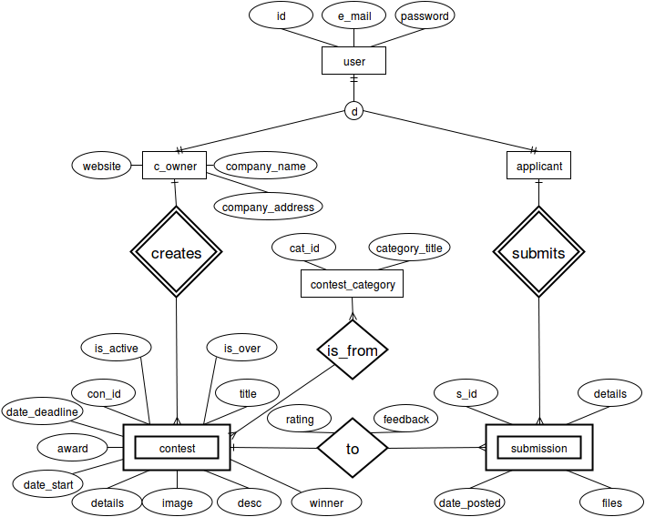

#Database Architecture
This document contains the database architecture & schemas of Next For Now.

---

##Database Tables for Users
Existing Django models for users will be used. Additional fields for users will be added via profile models.

###Admins
- id
- username (e-mail)
- password

###Contest Owners
- id
- username (e-mail)
- password
- company name
- company address
- website

###Applicants
- id
- username (e-mail)
- password

---

##Database Tables for Contents
###Contests
- owner -> ForeignKey(C_Owner)
- title
- category -> Selected from a list of Categories
- description
- details
- image
- award
- is_approved -> controlled by Admins
- is_ongoing (Related to deadline)
- date_start
- date_deadline

###Submissions
- contest -> ForeignKey(Contests)
- applicant -> ForeignKey(Applicants)
- applicant name(s) -> filled by Applicant
- applicant details -> filled by Applicant
- submission details -> filled by Applicant
- files -> uploaded by Applicant
- date_posted
- feedback -> filled by Contest Owner (TextField)
- is_winner -> filled by Contest Owner (Boolean)

---

###Schema Drawings

